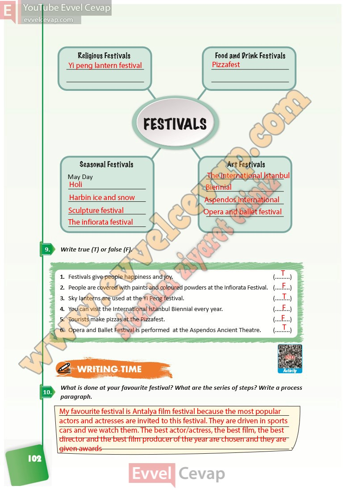

## 10. Sınıf İngilizce Ders Kitabı Cevapları Pasifik Yayınları Sayfa 102

**Soru: Write true (T) or false (F).**

1. Festivals give people happiness and joy.  
 2. People are covered with paints and coloured powders at the Infiorata Festival.  
 3. Sky lanterns are used at the Yi Peng festival.  
 4. You can visit the International İstanbul Biennial every year.  
 5. Tourists make pizzas at the Pizzafest.  
 6. Opera and Ballet Festival is performed at the Aspendos Ancient Theatre.

**Soru: What is done at your f avourite festival? What are the series of s teps? Write a process paragraph.**

**10. Sınıf Pasifik Yayınları İngilizce Ders Kitabı Sayfa 102**