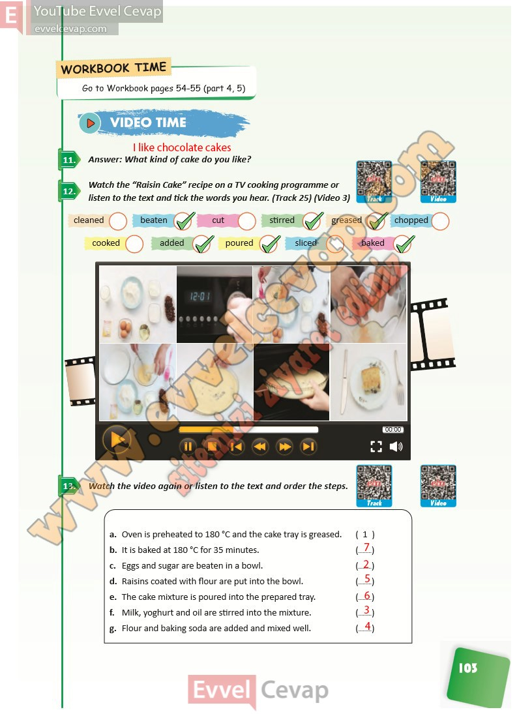

## 10. Sınıf İngilizce Ders Kitabı Cevapları Pasifik Yayınları Sayfa 103

**Soru: Answer: What kind of cake do you like?**

**Soru: Watch the “Raisin Cake” recipe on a TV cooking programme or listen to the text and tick the words you hear. (Track 25) (Video 3)**

**Soru: Watch the video again or lis ten to the text and order the steps.**

**10. Sınıf Pasifik Yayınları İngilizce Ders Kitabı Sayfa 103**