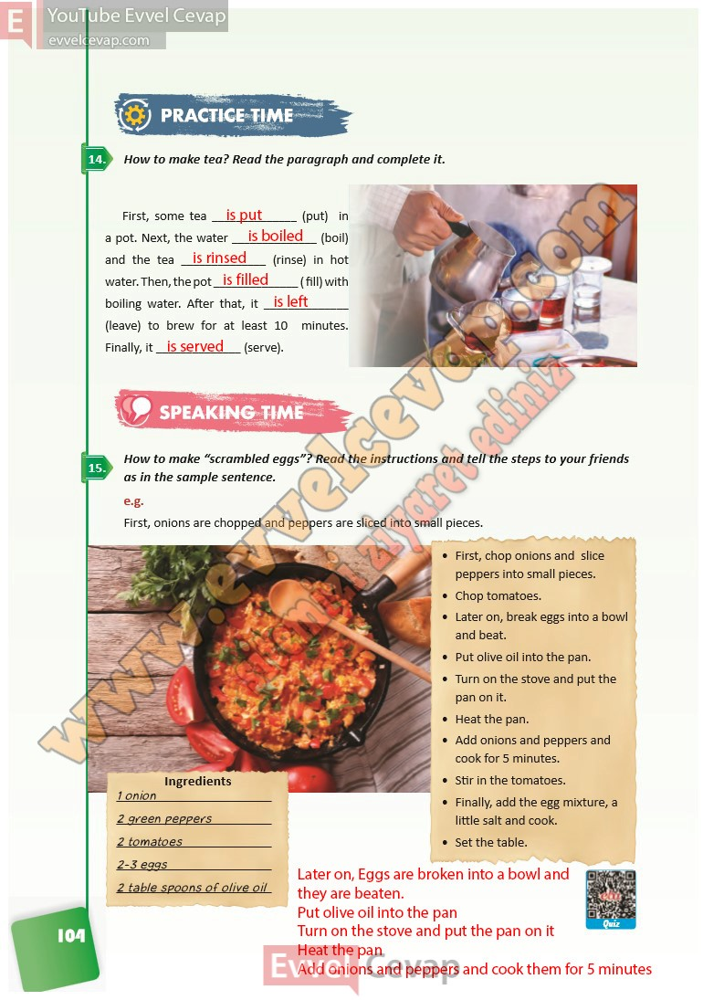

## 10. Sınıf İngilizce Ders Kitabı Cevapları Pasifik Yayınları Sayfa 104

**Soru: How to make tea? Read the paragraph and complete it.**

**Soru: How to make “scrambled eggs”? Read the instructions and tell the steps to your friends as in the sample sentence.**

**10. Sınıf Pasifik Yayınları İngilizce Ders Kitabı Sayfa 104**