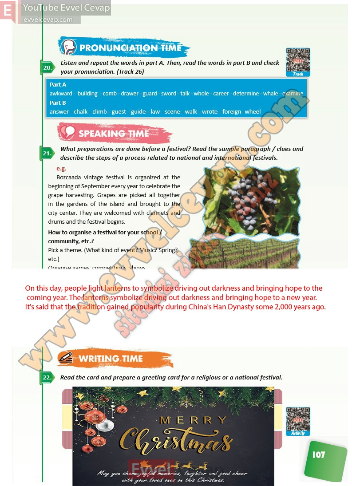

## 10. Sınıf İngilizce Ders Kitabı Cevapları Pasifik Yayınları Sayfa 107

**Soru: Listen and repeat the words in part A. Then, read the words in part B and check your pronunciation. (Track 26)**

**Soru: What preparations are done before a festival? Read the sample paragraph / clues and describe the steps of a process related to national and international festivals.**

**Soru: How to organise a festival for your school / community, etc.?**

**Soru: Read the card and prepare a greeting card for a religious or a national f estival.**

**10. Sınıf Pasifik Yayınları İngilizce Ders Kitabı Sayfa 107**