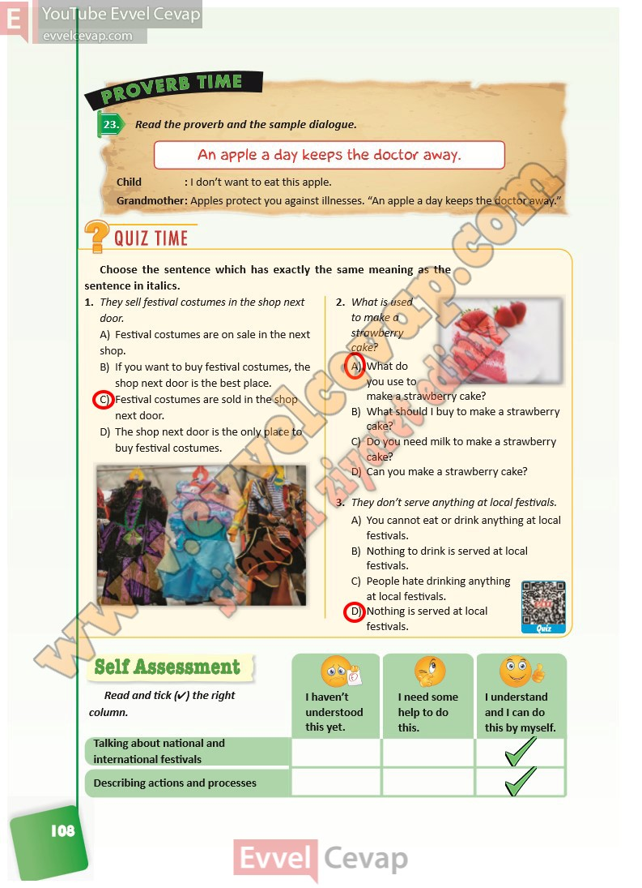

## 10. Sınıf İngilizce Ders Kitabı Cevapları Pasifik Yayınları Sayfa 108

**Soru: Read the proverb and the sample dialogue.**

**Soru: Choose the sentence which has exactly the same meaning as the sentence in italics.**

**Soru: They sell festival costumes in the shop next door.**

A) Festival costumes are on sale in the next shop.  
 B) If you want to buy festival costumes, the shop next door is the best place.  
 C) Festival costumes are sold in the shop next door.  
 D) The shop next door is the only place to buy festival costumes.

**Soru: What is used to make a strawberry cake?**

A) What do you use to make a strawberry cake?  
 B) What should I buy to make a strawberry cake?  
 C) Do you need milk to make a strawberry cake?  
 D) Can you make a strawberry cake?

**Soru: They don’t serve anything at local festivals.**

A) You cannot eat or drink anything at local festivals.  
 B) Nothing to drink is served at local festivals.  
 C) People hate drinking anything at local festivals.  
 D) Nothing is served at local festivals.

**Soru: Read and tick (4) the right column.**

**10. Sınıf Pasifik Yayınları İngilizce Ders Kitabı Sayfa 108**