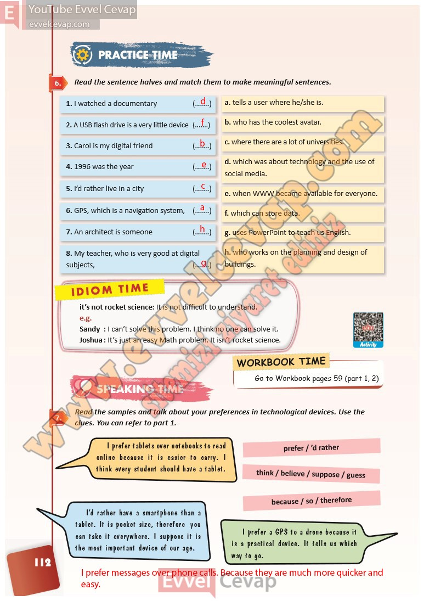

## 10. Sınıf İngilizce Ders Kitabı Cevapları Pasifik Yayınları Sayfa 112

**Soru: Read the sentence halves and match them to make meaningful sentences.**

**Soru: Read the samples and talk about your preferences in technological devices. Use the clues. You can refer to part 1.**

**10. Sınıf Pasifik Yayınları İngilizce Ders Kitabı Sayfa 112**