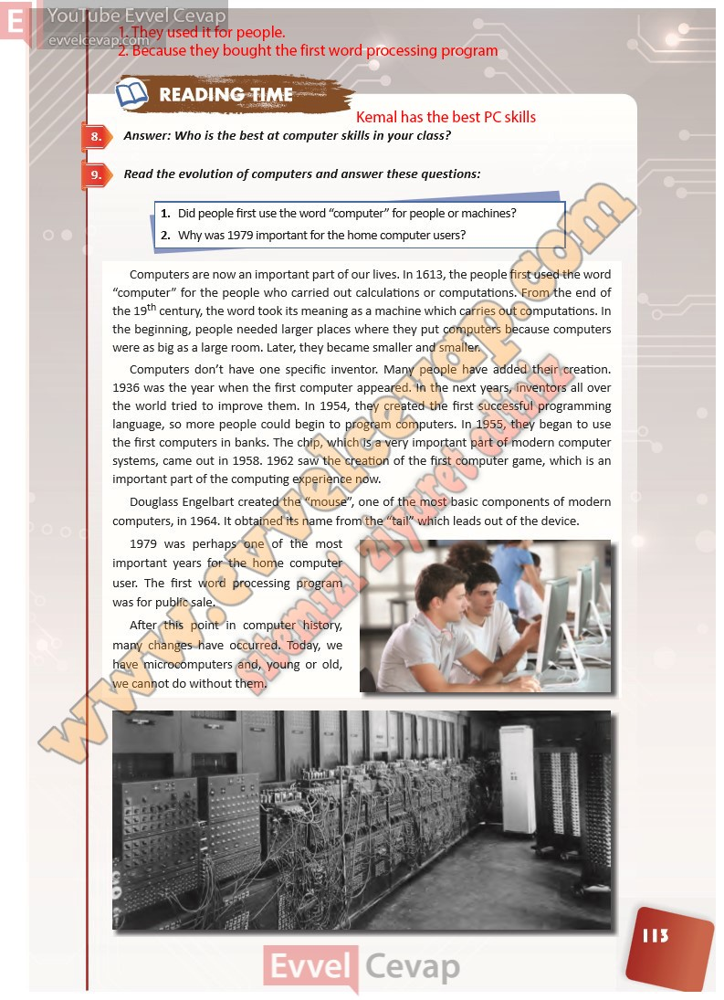

## 10. Sınıf İngilizce Ders Kitabı Cevapları Pasifik Yayınları Sayfa 113

**Soru: Answer: Who is the best at computer skills in your class?**

**Soru: Read the evolution of computers and answer these questions:**

**Soru: Did people first use the word “computer” for people or machines?**

**Soru: Why was 1979 important for the home computer users?**

**10. Sınıf Pasifik Yayınları İngilizce Ders Kitabı Sayfa 113**