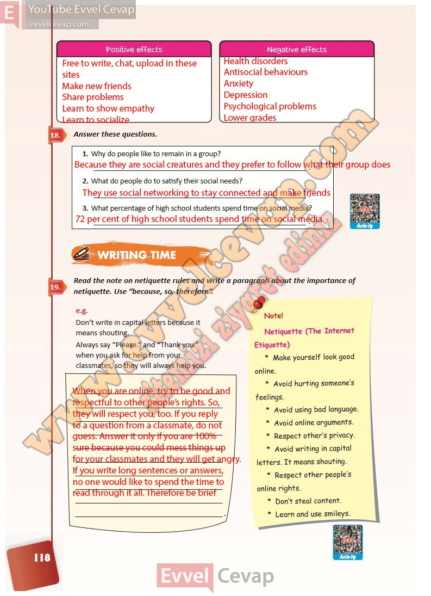

## 10. Sınıf İngilizce Ders Kitabı Cevapları Pasifik Yayınları Sayfa 118

**Soru: Answer these questions.**

**Soru: Why do people like to remain in a group?**

**Soru: What do people do to satisfy their social needs?**

**Soru: What percentage of high school students spend time on social media?**

**Soru: Read the note on netiquette rules and write a paragraph about the import ance of netiquette. Use “because, so, therefore”.**

**10. Sınıf Pasifik Yayınları İngilizce Ders Kitabı Sayfa 118**