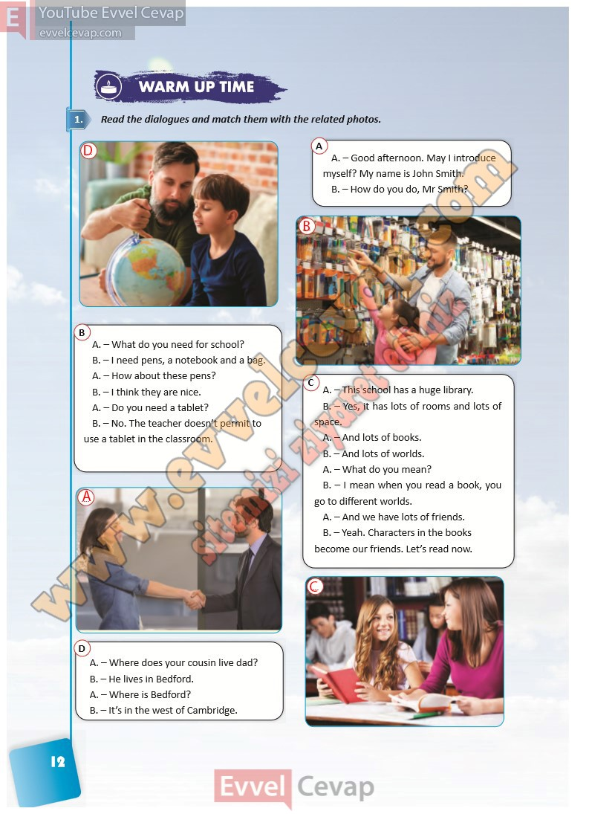

## 10. Sınıf İngilizce Ders Kitabı Cevapları Pasifik Yayınları Sayfa 12

**Soru: Read the dialogues and match them with the related photos.**

A. – Good afternoon. May I introduce myself? My name is John Smith.  
 B. – How do you do, Mr Smith?

A. – What do you need for school?  
 B. – I need pens, a notebook and a bag.  
 A. – How about these pens?  
 B. – I think they are nice.  
 A. – Do you need a tablet?  
 B. – No. The teacher doesn’t permit to use a tablet in the classroom.

A. – This school has a huge library.  
 B. – Yes, it has lots of rooms and lots of space.  
 A. – And lots of books.  
 B. – And lots of worlds.  
 A. – What do you mean?  
 B. – I mean when you read a book, you go to different worlds.  
 A. – And we have lots of friends.  
 B. – Yeah. Characters in the books become our friends. Let’s read now.

A. – Where does your cousin live dad?  
 B. – He lives in Bedford.  
 A. – Where is Bedford?  
 B. – It’s in the west of Cambridge.

**10. Sınıf Pasifik Yayınları İngilizce Ders Kitabı Sayfa 12**