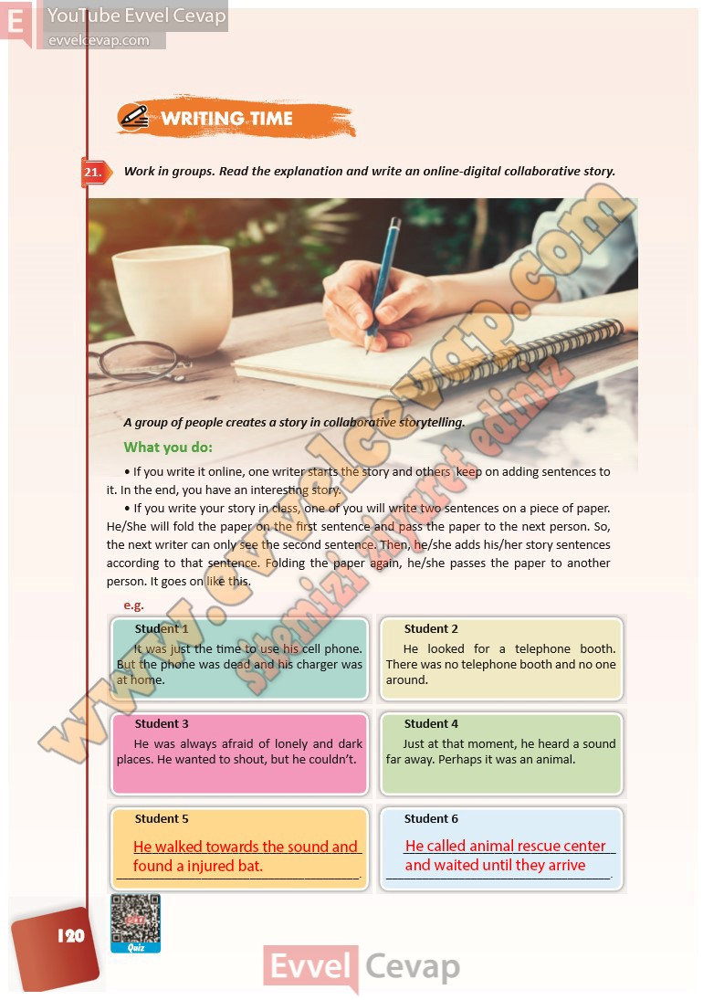

## 10. Sınıf İngilizce Ders Kitabı Cevapları Pasifik Yayınları Sayfa 120

**Soru: Work in groups. Read the explanation and write an online-digital collaborative story.**

**Soru: A group of people creates a story in collaborative storytelling.**

**10. Sınıf Pasifik Yayınları İngilizce Ders Kitabı Sayfa 120**