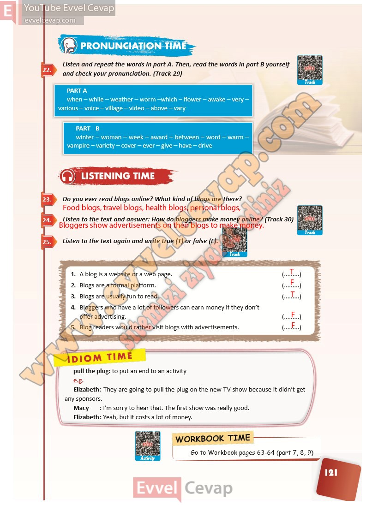

## 10. Sınıf İngilizce Ders Kitabı Cevapları Pasifik Yayınları Sayfa 121

**Soru: Listen and repeat the words in part A . Then, read the words in part B yourself and check your pronunciation. (Track 29)**

**Soru: Do you ever read blogs online? What kind of bl ogs are there?**

**Soru: Listen to the text and answer: How do bloggers make money online? (Track 30)**

**Soru: Listen to the text again and write true (T) or false (F).**

**10. Sınıf Pasifik Yayınları İngilizce Ders Kitabı Sayfa 121**