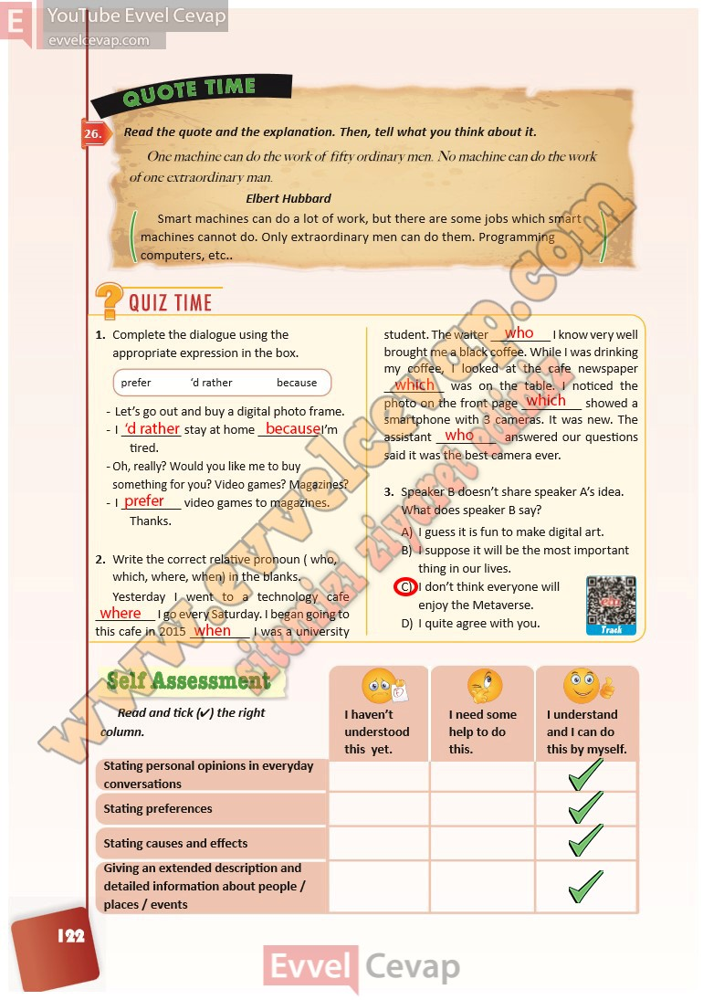

## 10. Sınıf İngilizce Ders Kitabı Cevapları Pasifik Yayınları Sayfa 122

**Soru: Read the quote and the explanation. Then, tell what you think about it.**

**Soru: Complete the dialogue using the appropriate expression in the box.**

**Soru: Write the correct relative pronoun ( who, which, where, when) in the blanks.**

**Soru: Speaker B doesn’t share speaker A’s idea. What does speaker B say?**

**Soru: Read and tick (4) the right column.**

**10. Sınıf Pasifik Yayınları İngilizce Ders Kitabı Sayfa 122**