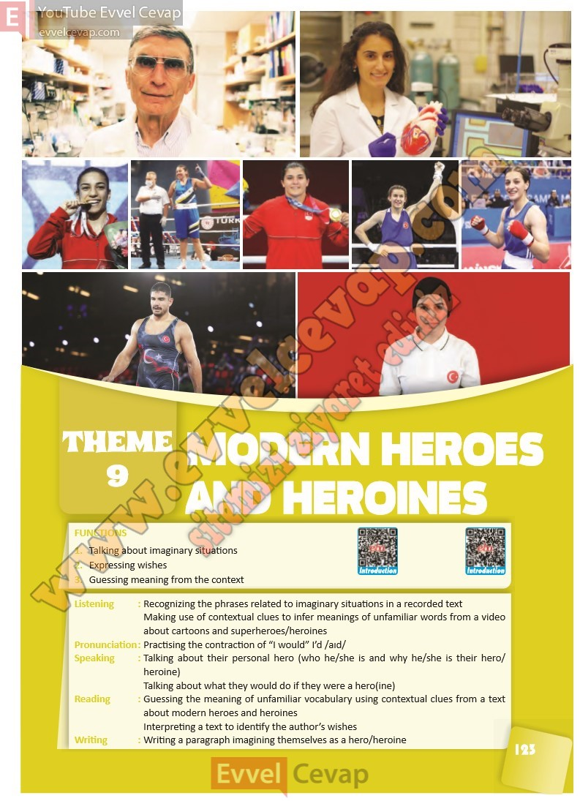

## 10. Sınıf İngilizce Ders Kitabı Cevapları Pasifik Yayınları Sayfa 123

FUNCTIONS  
 1. Talking about imaginary situations  
 2. Expressing wishes  
 3. Guessing meaning from the context  
 Listening : Recognizing the phrases related to imaginary situations in a recorded text  
 Making use of contextual clues to infer meanings of unfamiliar words from a video  
 about cartoons and superheroes/heroines  
 Pronunciation : Practising the contraction of “I would” I’d /aɪd/  
 Speaking : Talking about their personal hero (who he/she is and why he/she is their hero/  
 heroine)  
 Talking about what they would do if they were a hero(ine)  
 Reading : Guessing the meaning of unfamiliar vocabulary using contextual clues from a text  
 about modern heroes and heroines  
 Interpreting a text to identify the author’s wishes  
 Writing : Writing a paragraph imagining themselves as a hero/heroine

**10. Sınıf Pasifik Yayınları İngilizce Ders Kitabı Sayfa 123**