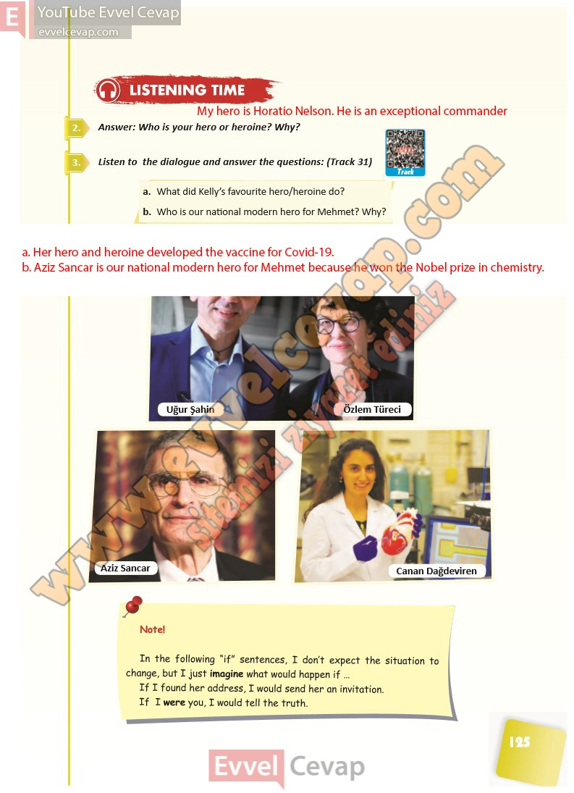

## 10. Sınıf İngilizce Ders Kitabı Cevapları Pasifik Yayınları Sayfa 125

**Soru: Answer: Who is your hero or heroine? Why?**

**Soru: Listen to the dialogue and answer the questions: (Track 31)**

**Soru: What did Kelly’s favourite hero/heroine do?**

**Soru: Who is our national modern hero for Mehmet? Why?**

**10. Sınıf Pasifik Yayınları İngilizce Ders Kitabı Sayfa 125**