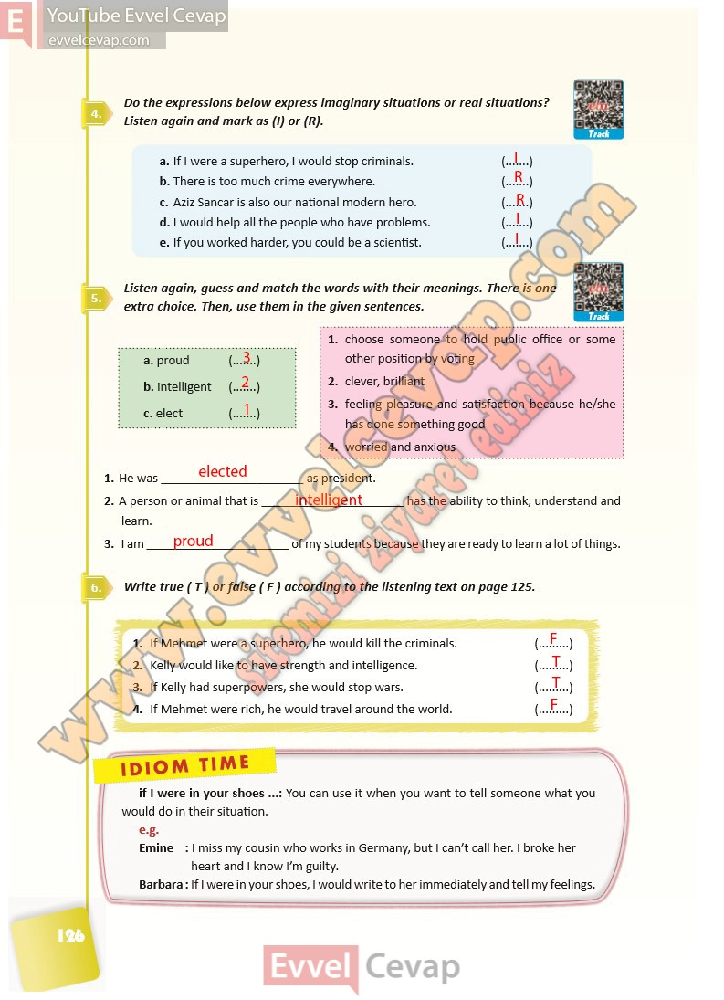

## 10. Sınıf İngilizce Ders Kitabı Cevapları Pasifik Yayınları Sayfa 126

**Soru: Do the expressions below express imaginary situations or real situations? Listen again and mark as ( I) or (R).**

**Soru: Listen again, guess and match the words with their meanings. There is one extra choice. Then, use them in the given sen tences.**

**Soru: Write true ( T ) or false ( F ) according to the listening text on page 125.**

**10. Sınıf Pasifik Yayınları İngilizce Ders Kitabı Sayfa 126**