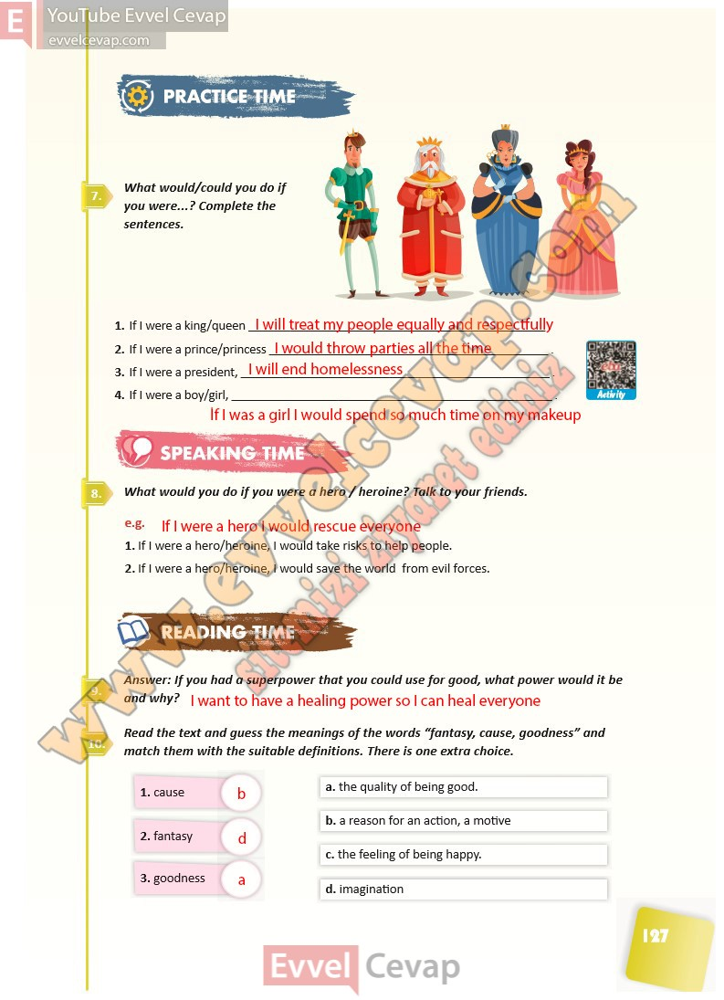

## 10. Sınıf İngilizce Ders Kitabı Cevapları Pasifik Yayınları Sayfa 127

**Soru: What would/could you do if you were…? Complete the sentences.**

**Soru: What would you do if you were a hero / heroine? T alk to your friends.**

**Soru: Answer: If you had a superpo wer that you could use for good, what power would it be and why?**

**Soru: Read the text and guess the meanings of the words “f antasy, cause, goodness” and match them with the suitable definitions. There is one extra choice.**

**10. Sınıf Pasifik Yayınları İngilizce Ders Kitabı Sayfa 127**