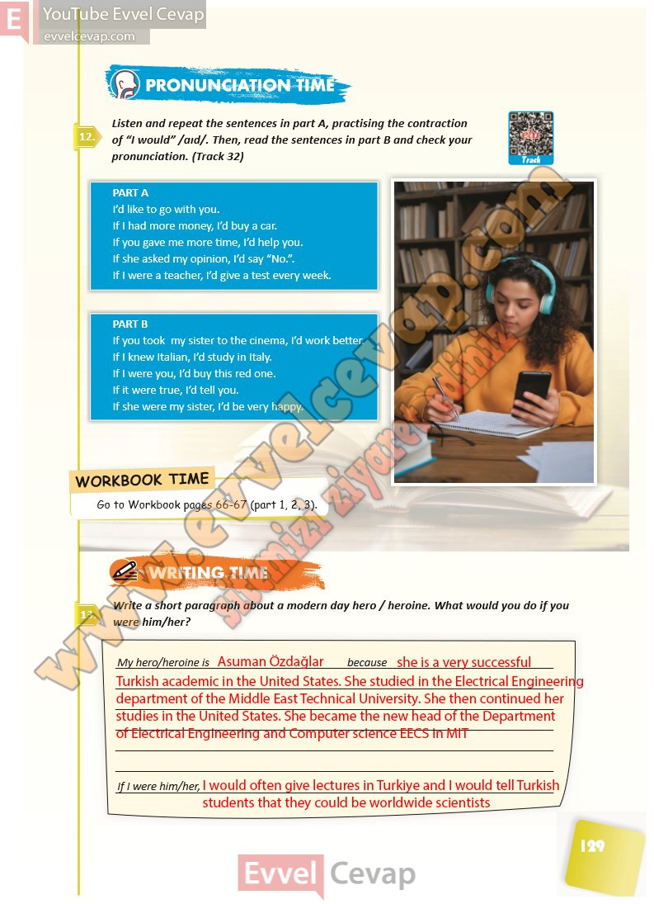

## 10. Sınıf İngilizce Ders Kitabı Cevapları Pasifik Yayınları Sayfa 129

**Soru: Listen and repeat the sentences in part A, practising the contraction of “I would” /aıd/. Then, read the sen tences in part B and check your pronunciation. (Track 32)**

**Soru: Write a short paragraph about a modern day hero / heroine. What would you do if you were him/her?**

**10. Sınıf Pasifik Yayınları İngilizce Ders Kitabı Sayfa 129**