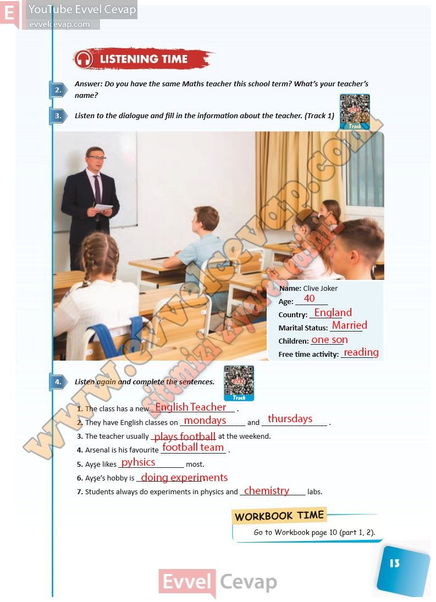

## 10. Sınıf İngilizce Ders Kitabı Cevapları Pasifik Yayınları Sayfa 13

**Soru: Answer: Do you have the same Maths teacher this school term? What’s your teacher’s name?**

**Soru: Listen to the dialogue and fill in the information about the teacher. (Track 1)**

**Soru: Listen again and complete the sentences.**

**10. Sınıf Pasifik Yayınları İngilizce Ders Kitabı Sayfa 13**