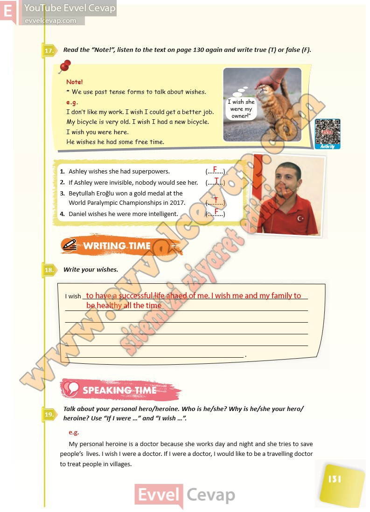

## 10. Sınıf İngilizce Ders Kitabı Cevapları Pasifik Yayınları Sayfa 131

**Soru: Read the “Note!”, listen to the text on page 130 again and writ e true (T) or false (F).**

**Soru: Write your wishes.**

**Soru: Talk about your personal hero/heroine. Who is he/ she? Why is he/she your hero/ heroine? Use “If I were …” and “I wish …” .**

**10. Sınıf Pasifik Yayınları İngilizce Ders Kitabı Sayfa 131**