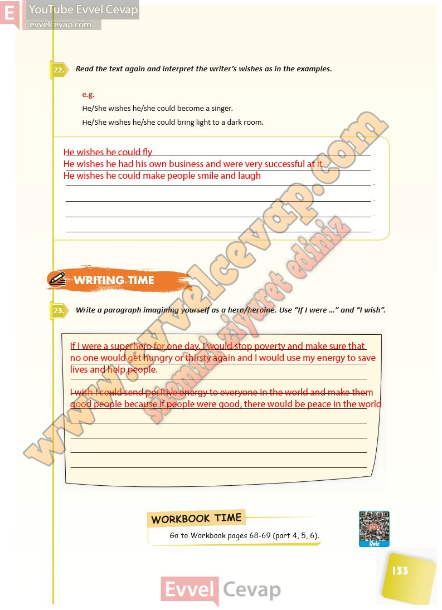

## 10. Sınıf İngilizce Ders Kitabı Cevapları Pasifik Yayınları Sayfa 133

**Soru: Read the text again and interpret the writer’s wishes as in the examples.**

**Soru: Write a paragraph imagining yourself as a hero/heroine. Use “If I were …” and “I wish”**

**10. Sınıf Pasifik Yayınları İngilizce Ders Kitabı Sayfa 133**