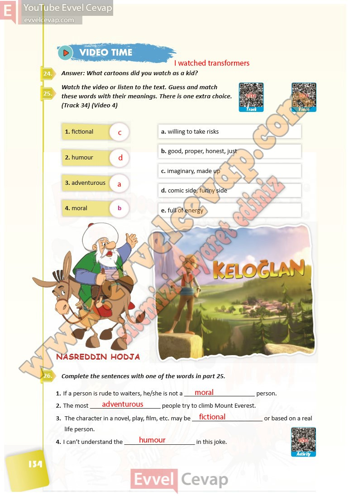

## 10. Sınıf İngilizce Ders Kitabı Cevapları Pasifik Yayınları Sayfa 134

**Soru: Answer: What cartoons did you watch as a kid?**

**Soru: Watch the video or listen to the text. Guess and match these words with their meanings. There is one e xtra choice. (Track 34) (Video 4)**

**Soru: Complete the sentences with one of the words in part 25.**

**10. Sınıf Pasifik Yayınları İngilizce Ders Kitabı Sayfa 134**