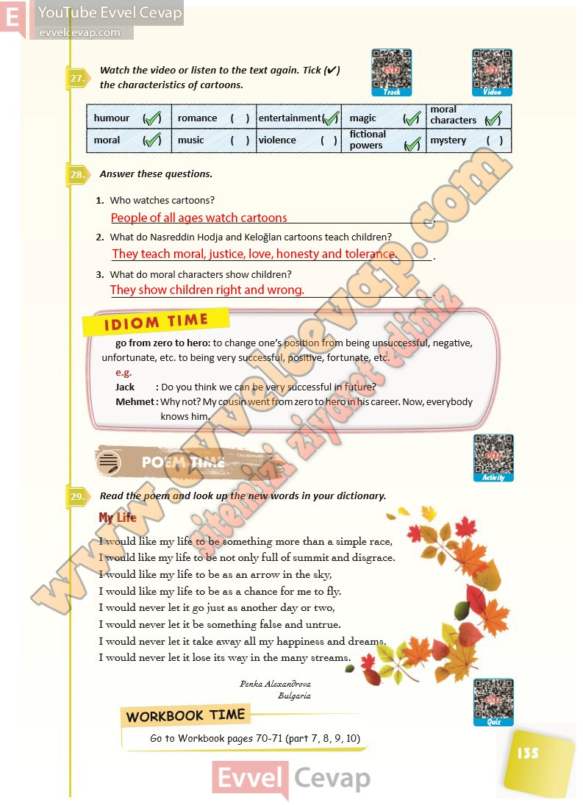

## 10. Sınıf İngilizce Ders Kitabı Cevapları Pasifik Yayınları Sayfa 135

**Soru: Watch the video or listen to the text again. Tick (4) the characteristics of cartoons.**

**Soru: Answer these questions.**

**Soru: Who watches cartoons?**

**Soru: What do Nasreddin Hodja and Keloğlan cartoons teach children?**

**Soru: What do moral characters show children?**

**Soru: Read the poem and look up the new words in your dictionary.**

**10. Sınıf Pasifik Yayınları İngilizce Ders Kitabı Sayfa 135**