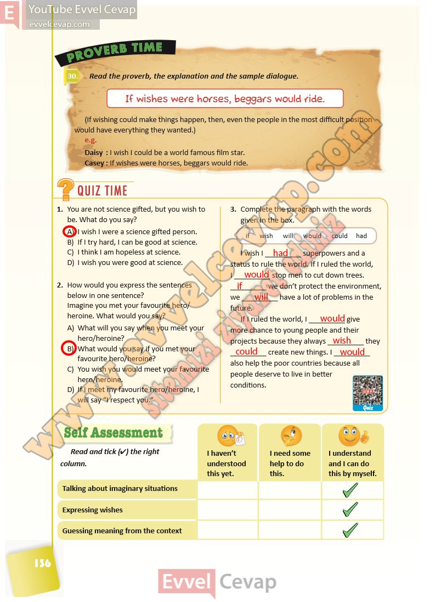

## 10. Sınıf İngilizce Ders Kitabı Cevapları Pasifik Yayınları Sayfa 136

**Soru: Read the proverb, the explanation and the sample dialogue.**

**Soru: You are not science gifted, but you wish to be. What do you say?**

A) I wish I were a science gifted person.  
 B) If I try hard, I can be good at science.  
 C) I think I am hopeless at science.  
 D) I wish you were good at science.

**Soru: How would you express the sentences below in one sentence? Imagine you met your favourite hero/ heroine. What would you say?**

A) What will you say when you meet your hero/heroine?  
 B) What would you say if you met your favourite hero/heroine?  
 C) You wish you would meet your favourite hero/heroine.  
 D) If I meet my favourite hero/heroine, I will say “I respect you.”

**Soru: Complete the paragraph with the words given in the box.**

**Soru: Read and tick (4) the right column.**

**10. Sınıf Pasifik Yayınları İngilizce Ders Kitabı Sayfa 136**