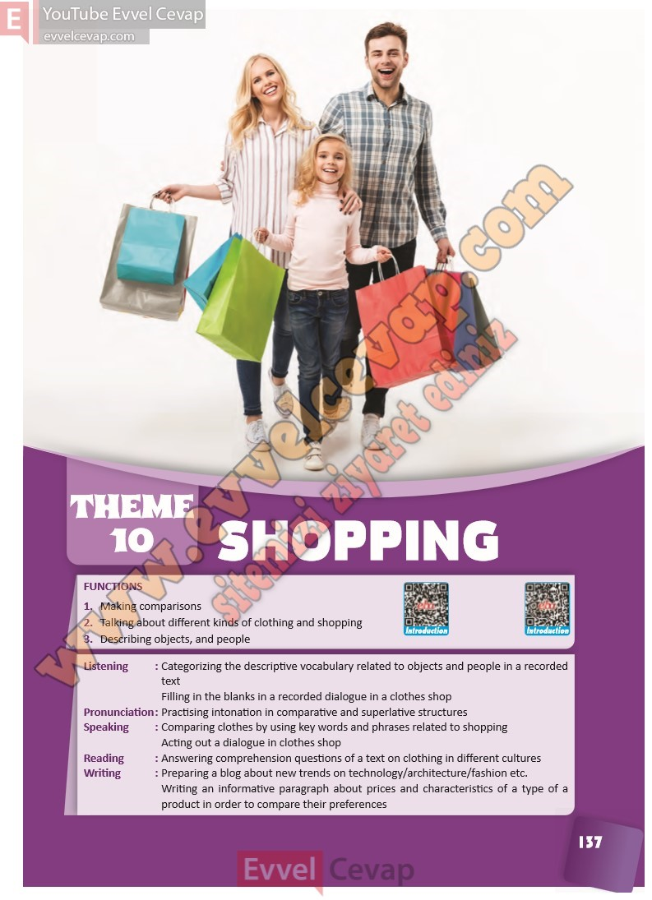

## 10. Sınıf İngilizce Ders Kitabı Cevapları Pasifik Yayınları Sayfa 137

FUNCTIONS  
 1. Making comparisons  
 2. Talking about different kinds of clothing and shopping  
 3. Describing objects, and people  
 Listening : Categorizing the descriptive vocabulary related to objects and people in a recorded  
 text  
 Filling in the blanks in a recorded dialogue in a clothes shop  
 Pronunciation : Practising intonation in comparative and superlative structures  
 Speaking : Comparing clothes by using key words and phrases related to shopping  
 Acting out a dialogue in clothes shop  
 Reading : Answering comprehension questions of a text on clothing in different cultures  
 Writing : Preparing a blog about new trends on technology/architecture/fashion etc.  
 Writing an informative paragraph about prices and characteristics of a type of a  
 product in order to compare their preferences

**10. Sınıf Pasifik Yayınları İngilizce Ders Kitabı Sayfa 137**