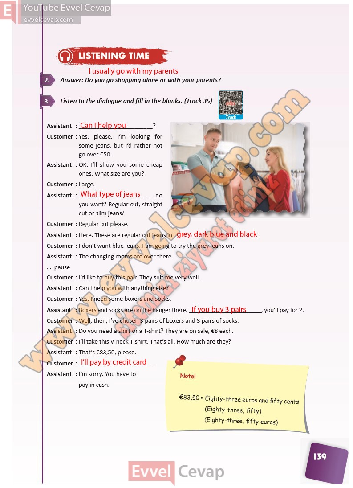

## 10. Sınıf İngilizce Ders Kitabı Cevapları Pasifik Yayınları Sayfa 139

**Soru: Answer: Do you go shopping alone or with your parents?**

**Soru: Listen to the dialogue and fill in the blank s. (Track 35)**

**10. Sınıf Pasifik Yayınları İngilizce Ders Kitabı Sayfa 139**