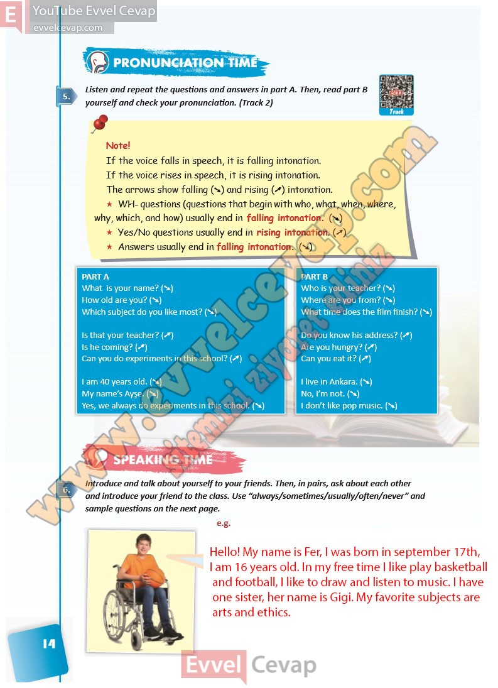

## 10. Sınıf İngilizce Ders Kitabı Cevapları Pasifik Yayınları Sayfa 14

**Soru: Listen and repeat the questions and answers in part A. Then, read part B yourself and check your pronunciation. (Track 2)**

**Soru: Introduce and talk about yourself to your friends. Then, in pairs, ask about each other and introduce your friend to the class. Use “always/sometimes/usually/often/never” and sample questions on the next page.**

**10. Sınıf Pasifik Yayınları İngilizce Ders Kitabı Sayfa 14**