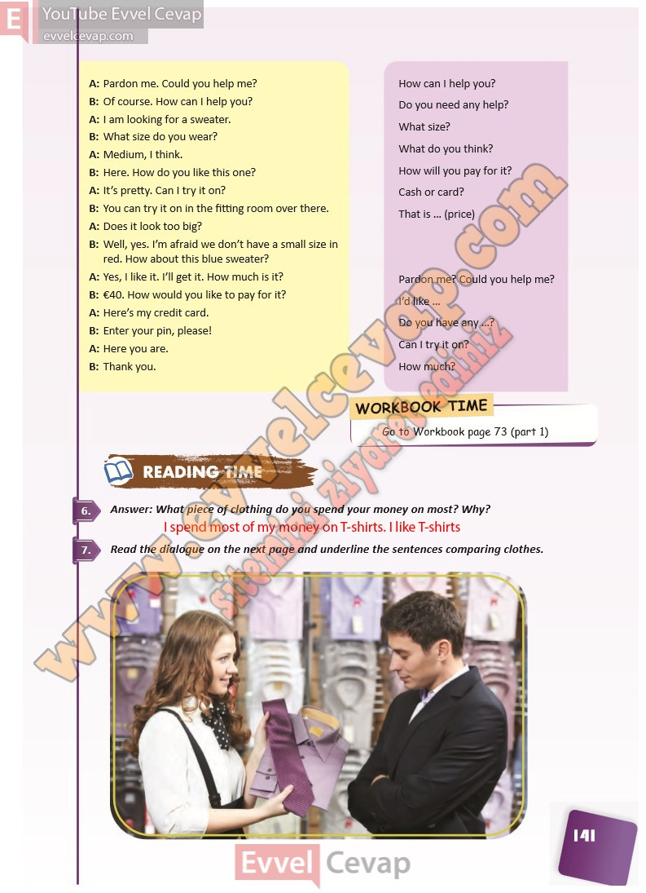

## 10. Sınıf İngilizce Ders Kitabı Cevapları Pasifik Yayınları Sayfa 141

A: Pardon me. Could you help me?  
 B: Of course. How can I help you?  
 A: I am looking for a sweater.  
 B: What size do you wear?  
 A: Medium, I think.  
 B: Here. How do you like this one?  
 A: It’s pretty. Can I try it on?  
 B: You can try it on in the fitting room over there.  
 A: Does it look too big?  
 B: Well, yes. I’m afraid we don’t have a small size in  
 red. How about this blue sweater?  
 A: Yes, I like it. I’ll get it. How much is it?  
 B: €40. How would you like to pay for it?  
 A: Here’s my credit card.  
 B: Enter your pin, please!  
 A: Here you are.  
 B: Thank you.

**Soru: Answer: What piece of clothing do you spend your mone y on most? Why?**

**Soru: Read the dialogue on the next page and underline the sentences comparing clothes.**

**10. Sınıf Pasifik Yayınları İngilizce Ders Kitabı Sayfa 141**