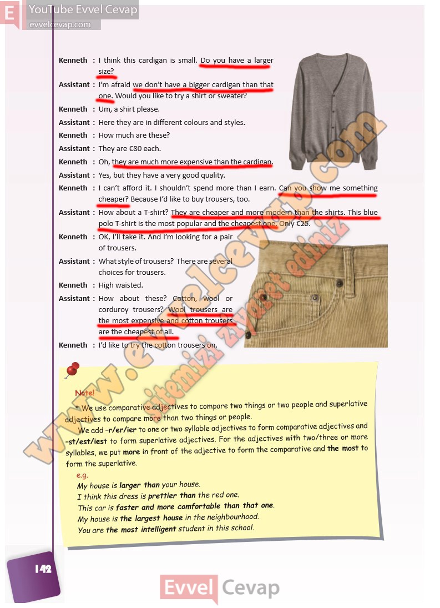

## 10. Sınıf İngilizce Ders Kitabı Cevapları Pasifik Yayınları Sayfa 142

I think this cardigan is small. Do you have a larger size?  
 I’m afraid we don’t have a bigger cardigan than that one. Would you like to try a shirt or sweater?  
 Um, a shirt please.  
 Here they are in different colours and styles.  
 How much are these?  
 They are €80 each.  
 Oh, they are much more expensive than the cardigan. Yes, but they have a very good quality.  
 I can’t afford it. I shouldn’t spend more than I earn. Can you show me something cheaper? Because I’d like to buy trousers, too.  
 How about a T-shirt? They are cheaper and more modern than the shirts. This blue polo T-shirt is the most popular and the cheapest one. Only €25.  
 OK, I’ll take it. And I’m looking for a pair of trousers.  
 What style of trousers? There are several choices for trousers.  
 High waisted.  
 How about these? Cotton, wool or corduroy trousers? Wool trousers are the most expensive and cotton trousers are the cheapest of all.  
 I’d like to try the cotton trousers on.

**10. Sınıf Pasifik Yayınları İngilizce Ders Kitabı Sayfa 142**