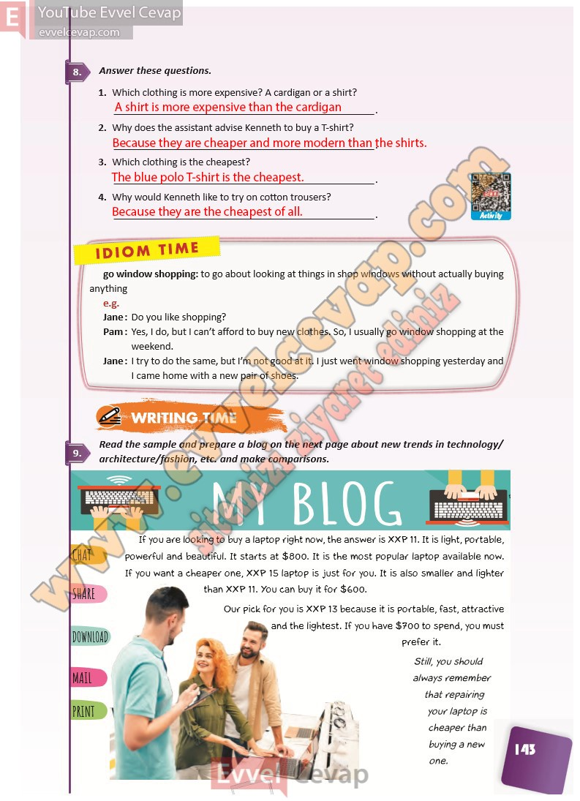

## 10. Sınıf İngilizce Ders Kitabı Cevapları Pasifik Yayınları Sayfa 143

**Soru: Answer these questions.**

**Soru: Which clothing is more expensive? A cardigan or a shirt?**

**Soru: Why does the assistant advise Kenneth to buy a T-shirt?**

**Soru: Which clothing is the cheapest?**

**Soru: Why would Kenneth like to try on cotton trousers?**

**Soru: Read the sample and prepare a blog on the ne xt page about new trends in technology/ 9. architecture/fashion, etc. and make comparisons.**

**10. Sınıf Pasifik Yayınları İngilizce Ders Kitabı Sayfa 143**