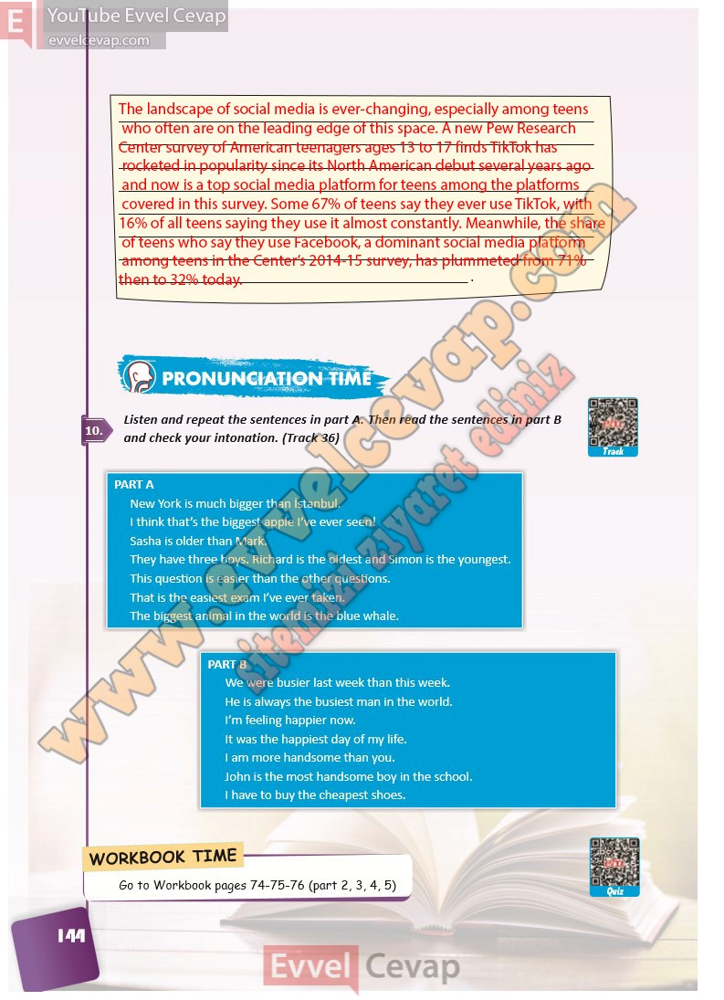

## 10. Sınıf İngilizce Ders Kitabı Cevapları Pasifik Yayınları Sayfa 144

**Soru: Listen and repeat the sentences in part A. Then read the sentences in part B and check your intonation. (Track 36)**

**10. Sınıf Pasifik Yayınları İngilizce Ders Kitabı Sayfa 144**