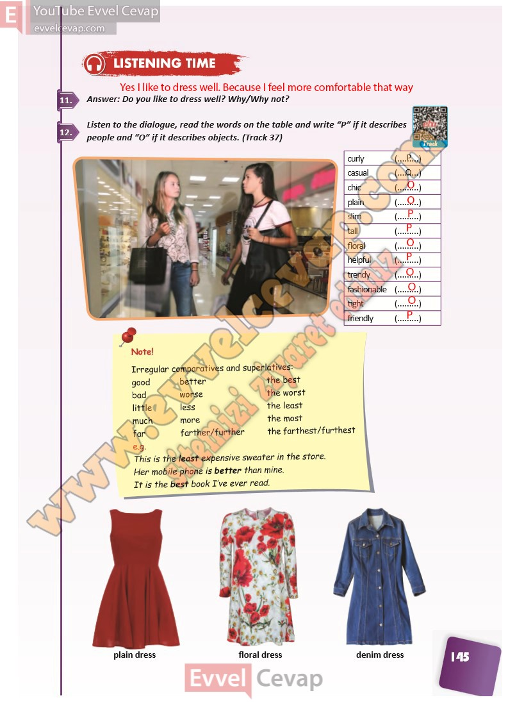

## 10. Sınıf İngilizce Ders Kitabı Cevapları Pasifik Yayınları Sayfa 145

**Soru: Answer: Do you like to dress well? Why/Why not?**

**Soru: Listen to the dialogue, read the words on the t able and write “P” if it describes people and “O” if it describes objects. (Track 37)**

**10. Sınıf Pasifik Yayınları İngilizce Ders Kitabı Sayfa 145**