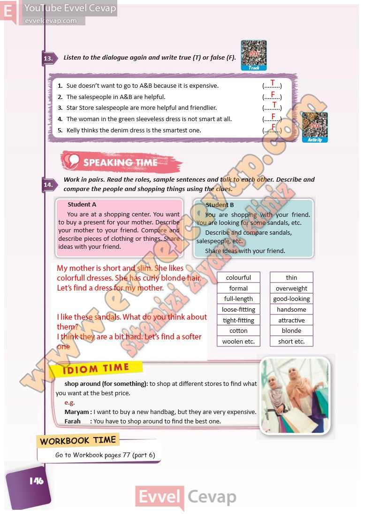

## 10. Sınıf İngilizce Ders Kitabı Cevapları Pasifik Yayınları Sayfa 146

**Soru: Listen to the dialogue again and write true (T) or false (F).**

1. Sue doesn’t want to go to A&B because it is expensive.  
 2. The salespeople in A&B are helpful.  
 3. Star Store salespeople are more helpful and friendlier.  
 4. The woman in the green sleeveless dress is not smart at all.  
 5. Kelly thinks the denim dress is the smartest one.

**Soru: Work in pairs. Read the roles, sample sentences and talk to each other. Describe and compare the people and shopping things using the clues.**

**10. Sınıf Pasifik Yayınları İngilizce Ders Kitabı Sayfa 146**