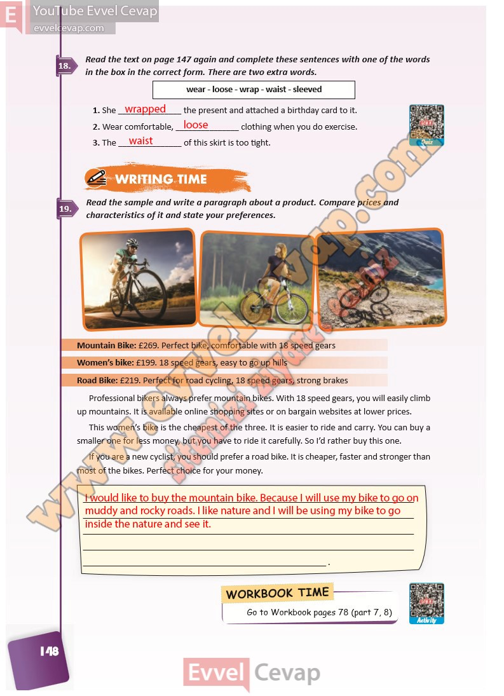

## 10. Sınıf İngilizce Ders Kitabı Cevapları Pasifik Yayınları Sayfa 148

**Soru: Read the text on page 147 again and c omplete these sentences with one of the words in the box in the correct form. There are two extra words.**

**Soru: Read the sample and write a paragraph about a product. C ompare prices and characteristics of it and state your preferences.**

**10. Sınıf Pasifik Yayınları İngilizce Ders Kitabı Sayfa 148**