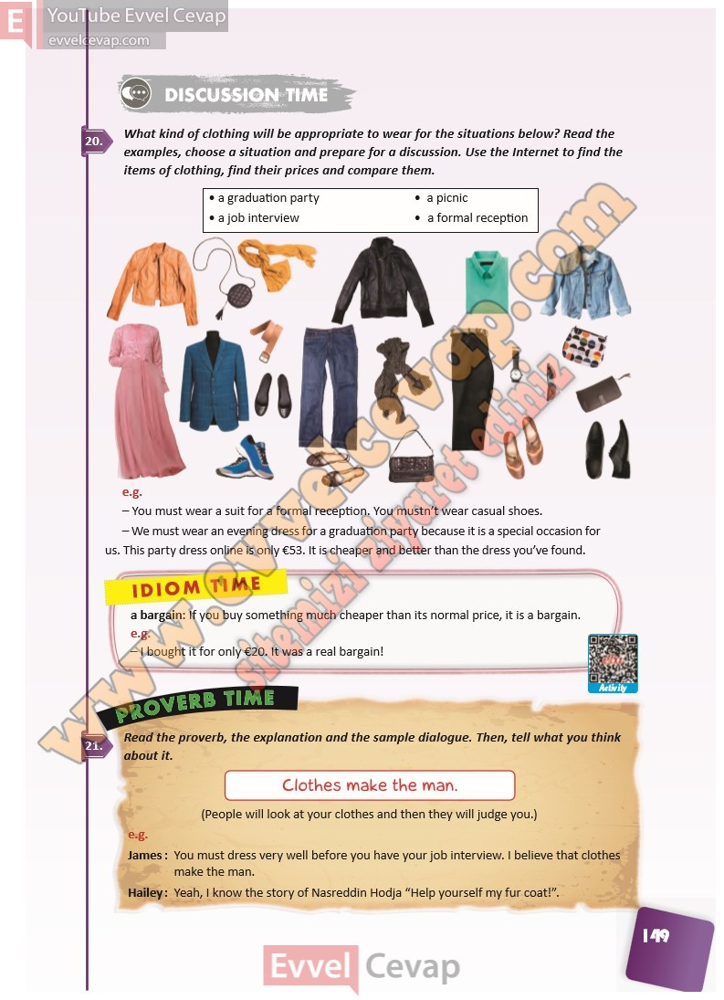

## 10. Sınıf İngilizce Ders Kitabı Cevapları Pasifik Yayınları Sayfa 149

**Soru: What kind of clothing will be appropriat e to wear for the situations below? Read the examples, choose a situation and prepare f or a discussion. Use the In ternet to find the items of clothing, find their pric es and compare them.**

**Soru: Read the proverb, the explanation and the sample dialogue. Then, t ell what you think about it.**

**10. Sınıf Pasifik Yayınları İngilizce Ders Kitabı Sayfa 149**