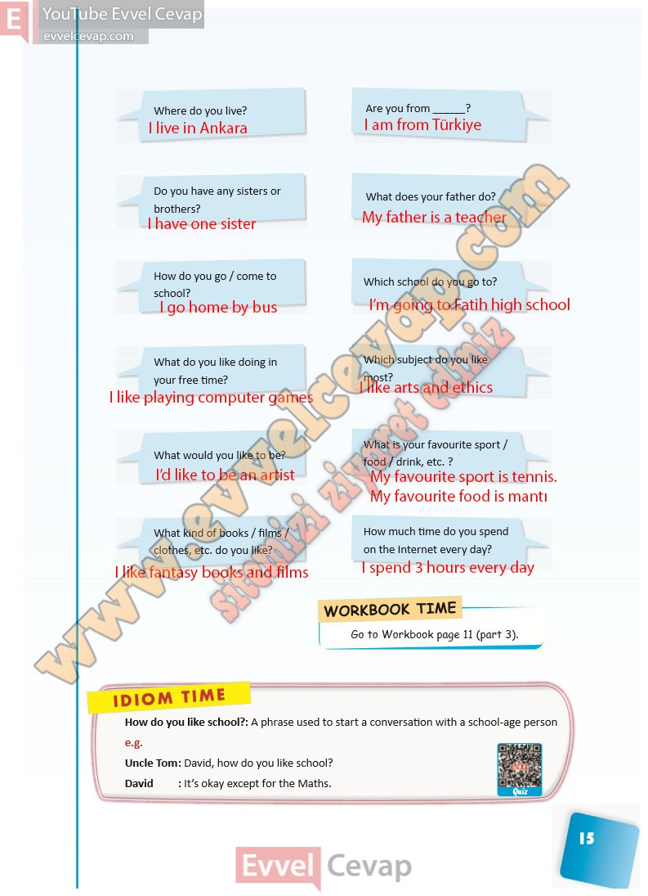

## 10. Sınıf İngilizce Ders Kitabı Cevapları Pasifik Yayınları Sayfa 15

**Soru: Where do you live?**

**Soru: Are you from \_?**

**Soru: Do you have any sisters or brothers?**

**Soru: What does your father do?**

**Soru: How do you go / come to school?**

**Soru: Which school do you go to?**

**Soru: What do you like doing in your free time?**

**Soru: Which subject do you like most?**

**Soru: What would you like to be?**

**Soru: What is your favourite sport / food / drink, etc. ?**

**Soru: What kind of books / films / clothes, etc. do you like?**

**Soru: How much time do you spend on the Internet every day?**

**10. Sınıf Pasifik Yayınları İngilizce Ders Kitabı Sayfa 15**