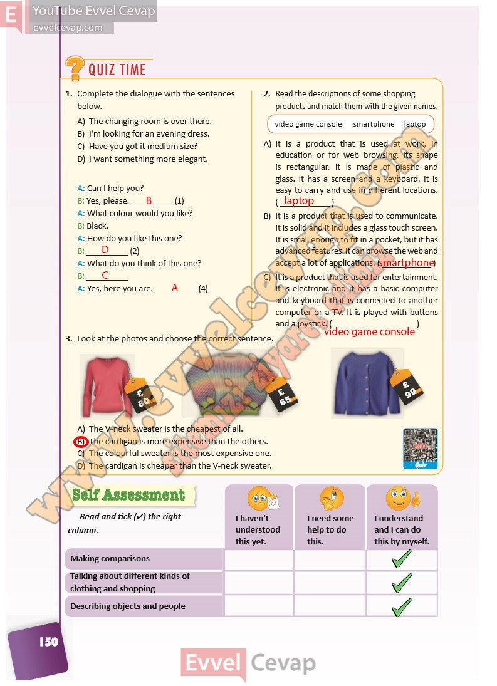

## 10. Sınıf İngilizce Ders Kitabı Cevapları Pasifik Yayınları Sayfa 150

**Soru: Complete the dialogue with the sentences below.**

**Soru: Read the descriptions of some shopping products and match them with the given names.**

A) It is a product that is used at work, in  
 education or for web browsing. Its shape  
 is rectangular. It is made of plastic and  
 glass. It has a screen and a keyboard. It is  
 easy to carry and use in different locations.  
 B) It is a product that is used to communicate.  
 It is solid and it includes a glass touch screen.  
 It is small enough to fit in a pocket, but it has  
 advanced features. It can browse the web and  
 accept a lot of applications.  
 C) It is a product that is used for entertainment.  
 It is electronic and it has a basic computer  
 and keyboard that is connected to another  
 computer or a TV. It is played with buttons  
 and a joystick.

**Soru: Look at the photos and choose the correct sentence.**

A) The V-neck sweater is the cheapest of all.  
 B) The cardigan is more expensive than the others.  
 C) The colourful sweater is the most expensive one.  
 D) The cardigan is cheaper than the V-neck sweater.

**Soru: Read and tick (4) the right column.**

**10. Sınıf Pasifik Yayınları İngilizce Ders Kitabı Sayfa 150**