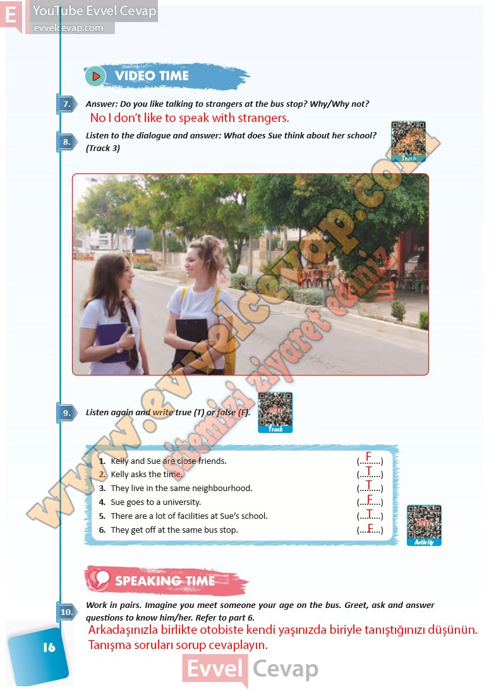

## 10. Sınıf İngilizce Ders Kitabı Cevapları Pasifik Yayınları Sayfa 16

**Soru: Answer: Do you like talking to strangers at the bus stop? Why/Why not?**

**Soru: Listen to the dialogue and answer: What does Sue think about her school? (Track 3)**

**Soru: Listen again and write true (T) or false (F).**

1. Kelly and Sue are close friends.  
 2. Kelly asks the time.  
 3. They live in the same neighbourhood.  
 4. Sue goes to a university.  
 5. There are a lot of facilities at Sue’s school.  
 6. They get off at the same bus stop.

**Soru: Work in pairs. Imagine you meet someone your age on the bus. Greet, ask and answer questions to know him/her. Refer to part 6.**

**10. Sınıf Pasifik Yayınları İngilizce Ders Kitabı Sayfa 16**