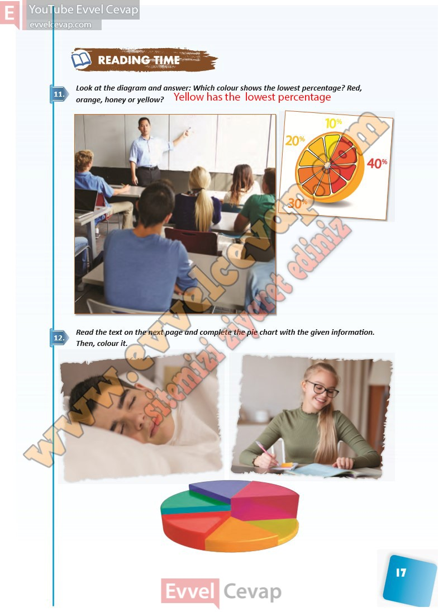

## 10. Sınıf İngilizce Ders Kitabı Cevapları Pasifik Yayınları Sayfa 17

**Soru: Look at the diagram and answer: Which colour shows the lowest percentage? Red, orange, honey or yellow?**

**Soru: Read the text on the next page and complete the pie chart with the given information. Then, colour it.**

**10. Sınıf Pasifik Yayınları İngilizce Ders Kitabı Sayfa 17**