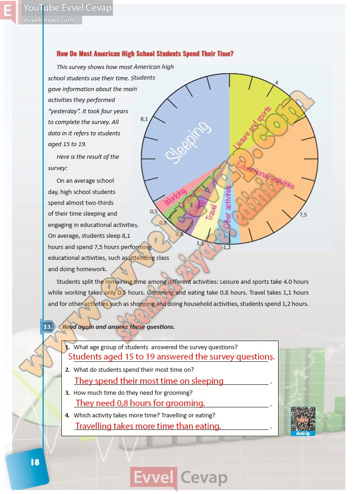

## 10. Sınıf İngilizce Ders Kitabı Cevapları Pasifik Yayınları Sayfa 18

How Do Most American High School Students Spend Their Time?  
 This survey shows how most American high school students use their time. Students gave information about the main activities they performed “yesterday”. It took four years to complete the survey. All data in it refers to students aged 15 to 19.  
 Here is the result of the survey:  
 On an average school day, high school students spend almost two-thirds of their time sleeping and engaging in educational activities.  
 On average, students sleep 8,1 hours and spend 7,5 hours performing educational activities, such as attending class and doing homework.  
 Students split the remaining time among different activities: Leisure and sports take 4.0 hours while working takes only 0.5 hours. Grooming and eating take 0.8 hours. Travel takes 1,1 hours and for other activities such as shopping and doing household activities, students spend 1,2 hours.

**Soru: Read again and answer these questions.**

**Soru: What age group of students answered the survey questions?**

**Soru: What do students spend their most time on?**

**Soru: How much time do they need for grooming?**

**Soru: Which activity takes more time? Travelling or eating?**

**10. Sınıf Pasifik Yayınları İngilizce Ders Kitabı Sayfa 18**