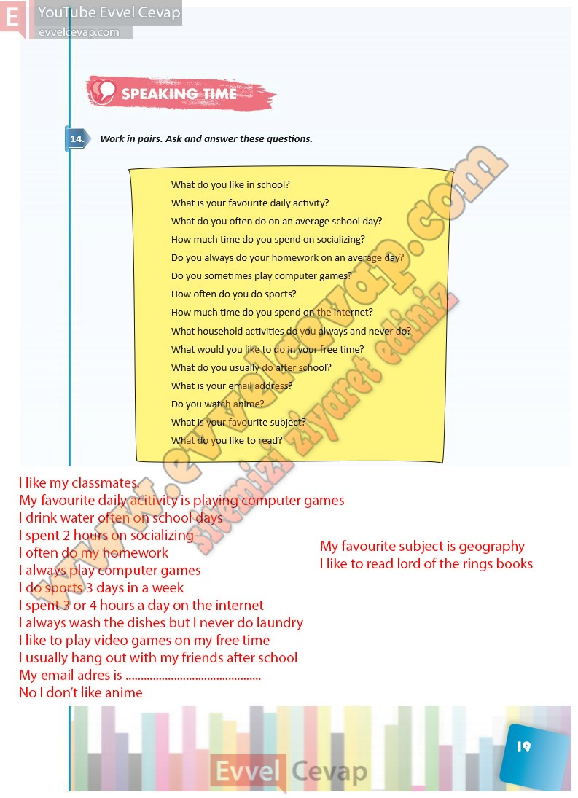

## 10. Sınıf İngilizce Ders Kitabı Cevapları Pasifik Yayınları Sayfa 19

**Soru: Work in pairs. Ask and answer these questions.**

**Soru: What do you like in school?**

**Soru: What is your favourite daily activity?**

**Soru: What do you often do on an average school day?**

**Soru: How much time do you spend on socializing?**

**Soru: Do you always do your homework on an average day?**

**Soru: Do you sometimes play computer games?**

**Soru: How often do you do sports?**

**Soru: How much time do you spend on the internet?**

**Soru: What household activities do you always and never do?**

**Soru: What would you like to do in your free time?**

**Soru: What do you usually do after school?**

**Soru: What is your email address?**

**Soru: Do you watch anime?**

**Soru: What is your favourite subject?**

**Soru: What do you like to read?**

**10. Sınıf Pasifik Yayınları İngilizce Ders Kitabı Sayfa 19**