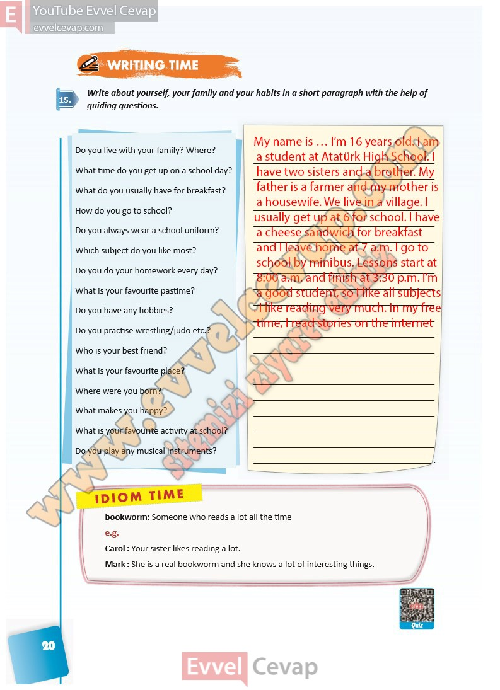

## 10. Sınıf İngilizce Ders Kitabı Cevapları Pasifik Yayınları Sayfa 20

**Soru: Write about yourself, your family and your habits in a short paragraph with the help of guiding questions.**

**Soru: Do you live with your family? Where?**

**Soru: What time do you get up on a school day?**

**Soru: What do you usually have for breakfast?**

**Soru: How do you go to school?**

**Soru: Do you always wear a school uniform?**

**Soru: Which subject do you like most?**

**Soru: Do you do your homework every day?**

**Soru: What is your favourite pastime?**

**Soru: Do you have any hobbies?**

**Soru: Do you practise wrestling/judo etc.?**

**Soru: Who is your best friend?**

**Soru: What is your favourite place?**

**Soru: Where were you born?**

**Soru: What makes you happy?**

**Soru: What is your favourite activity at school?**

**Soru: Do you play any musical instruments?**

**10. Sınıf Pasifik Yayınları İngilizce Ders Kitabı Sayfa 20**