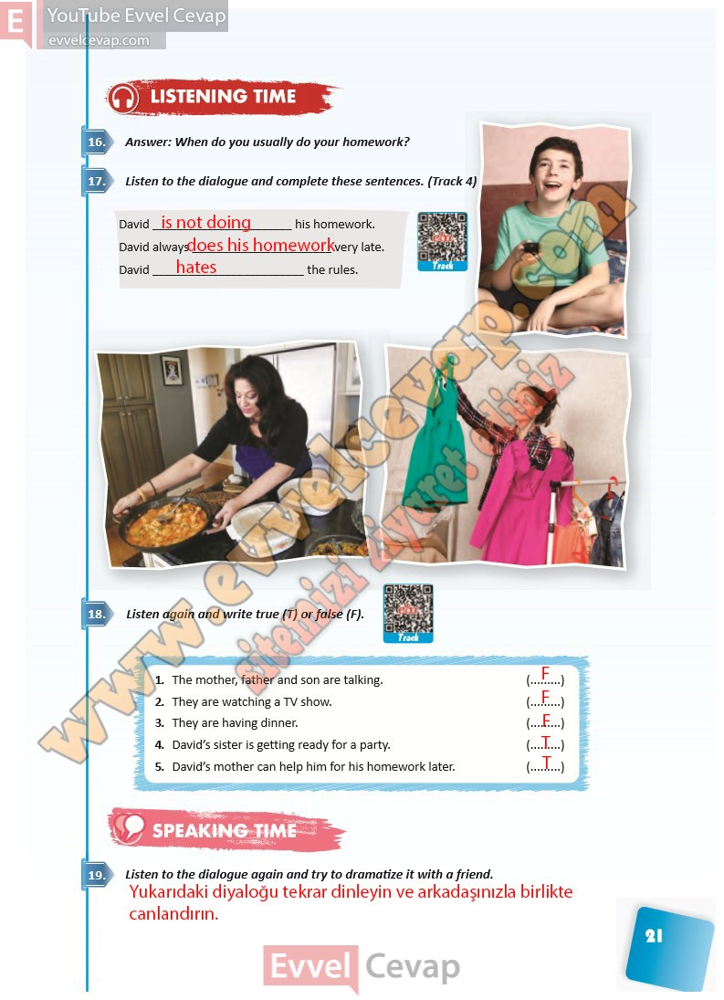

## 10. Sınıf İngilizce Ders Kitabı Cevapları Pasifik Yayınları Sayfa 21

**Soru: Answer: When do you usually do your homework?**

**Soru: Listen to the dialogue and complete these sentences. (Track 4)**

**Soru: Listen again and write true (T) or false**

1. The mother, father and son are talking.  
 2. They are watching a TV show.  
 3. They are having dinner.  
 4. David’s sister is getting ready for a party.  
 5. David’s mother can help him for his homework later.

**Soru: Listen to the dialogue again and try to dramatize it with a friend.**

**10. Sınıf Pasifik Yayınları İngilizce Ders Kitabı Sayfa 21**