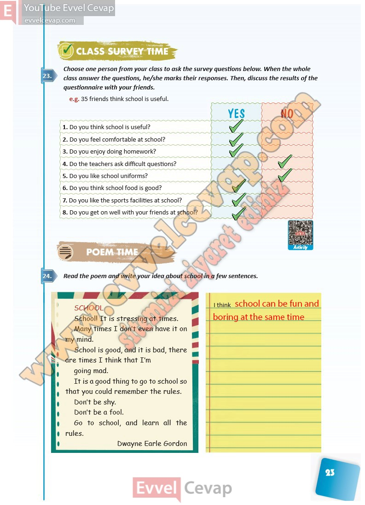

## 10. Sınıf İngilizce Ders Kitabı Cevapları Pasifik Yayınları Sayfa 23

**Soru: Choose one person from your class to ask the survey questions below. When the whole class answer the questions, he/she marks their responses. Then, discuss the results of the questionnaire with your friends.**

**Soru: Do you think school is useful?**

**Soru: Do you feel comfortable at school?**

**Soru: Do you enjoy doing homework?**

**Soru: Do the teachers ask difficult questions?**

**Soru: Do you like school uniforms?**

**Soru: Do you think school food is good?**

**Soru: Do you like the sports facilities at school?**

**Soru: Do you get on well with your friends at school?**

**Soru: Read the poem and write your idea about school in a few sentences.**

**10. Sınıf Pasifik Yayınları İngilizce Ders Kitabı Sayfa 23**