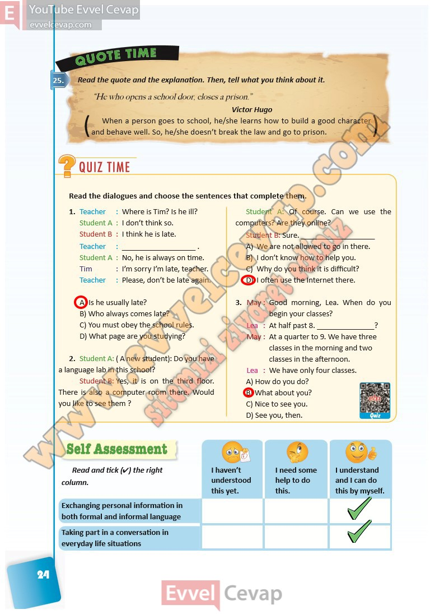

## 10. Sınıf İngilizce Ders Kitabı Cevapları Pasifik Yayınları Sayfa 24

Read the quote and the explanation. Then, tell what you think about it.

“He who opens a school door, closes a prison.”  
 Victor Hugo  
 When a person goes to school, he/she learns how to build a good character  
 and behave well. So, he/she doesn’t break the law and go to prison.

**Soru: Read the dialogues and choose the sentences that complete them.**

**Soru: Teacher : Where is Tim? Is he ill?  
 Student A : I don’t think so.  
 Student B : I think he is late.  
 Teacher : \_ .  
 Student A : No, he is always on time.  
 Tim : I’m sorry I’m late, teacher.  
 Teacher : Please, don’t be late again.**

A) Is he usually late?  
 B) Who always comes late?  
 C) You must obey the school rules.  
 D) What page are you studying?

**Soru: Student A: ( A new student): Do you have a language lab in this school?  
 Student B: Yes, it is on the third floor.  
 There is also a computer room there. Would you like to see them ?  
 Student A: Of course. Can we use the computers? Are they online?  
 Student B: Sure. \_**

A) We are not allowed to go in there.  
 B) I don’t know how to help you.  
 C) Why do you think it is difficult?  
 D) I often use the Internet there.

**Soru: May : Good morning, Lea. When do you  
 begin your classes?  
 Lea : At half past 8. \_?  
 May : At a quarter to 9. We have three  
 classes in the morning and two  
 classes in the afternoon.  
 Lea : We have only four classes.**

A) How do you do?  
 B) What about you?  
 C) Nice to see you.  
 D) See you, then.

**Soru: Read and tick (4) the right column.**

**10. Sınıf Pasifik Yayınları İngilizce Ders Kitabı Sayfa 24**