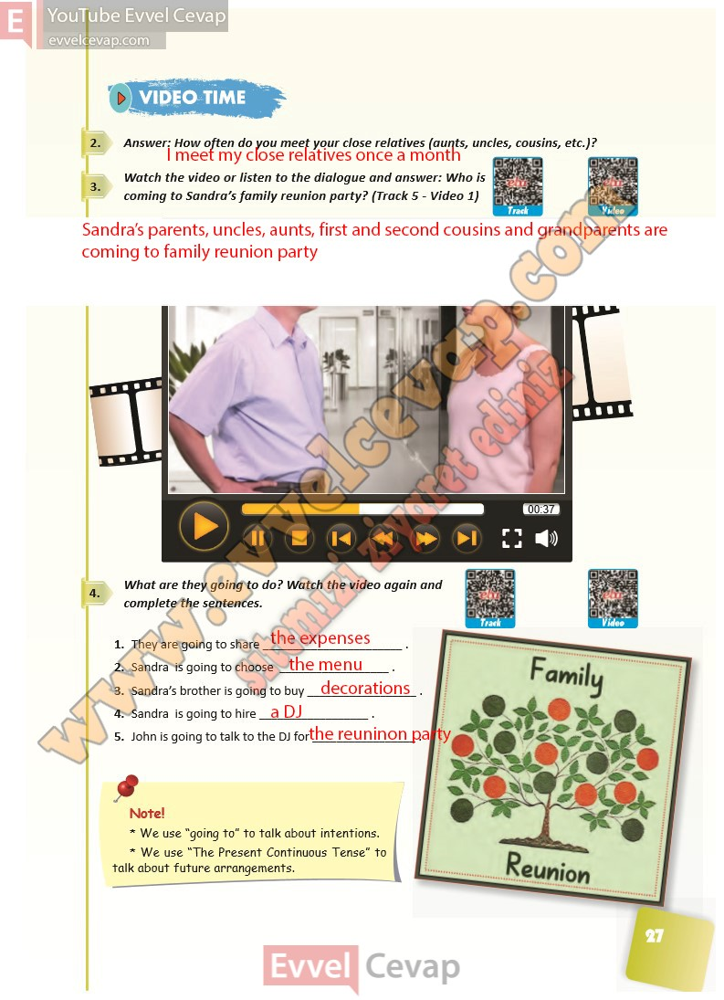

## 10. Sınıf İngilizce Ders Kitabı Cevapları Pasifik Yayınları Sayfa 27

**Soru: Answer: How often do you meet your close relatives (aunts, uncles, cousins, etc.)?**

**Soru: Watch the video or listen to the dialogue and answer: Who is coming to Sandra’s family reunion party? ( Track 5 – Video 1)**

**Soru: What are they going to do? Watch the video again and complete the sentences.**

1. They are going to share \_  
 2. Sandra is going to choose \_  
 3. Sandra’s brother is going to buy \_  
 4. Sandra is going to hire \_  
 5. John is going to talk to the DJ for \_

**10. Sınıf Pasifik Yayınları İngilizce Ders Kitabı Sayfa 27**