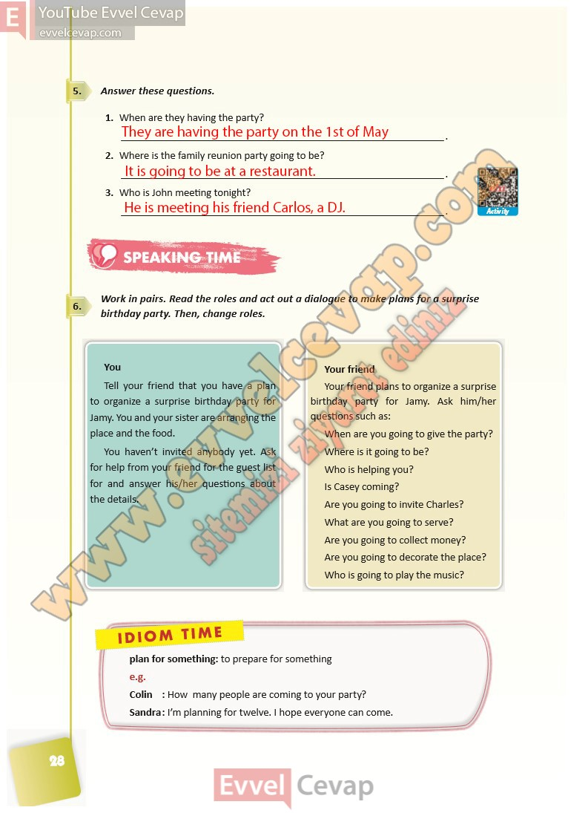

## 10. Sınıf İngilizce Ders Kitabı Cevapları Pasifik Yayınları Sayfa 28

**Soru: Answer these questions.**

**Soru: When are they having the party?**

**Soru: Where is the family reunion party going to be?**

**Soru: Who is John meeting tonight?**

**Soru: Work in pairs. Read the roles and act out a di alogue to make plans for a surprise birthday party. Then, change roles.**

**10. Sınıf Pasifik Yayınları İngilizce Ders Kitabı Sayfa 28**