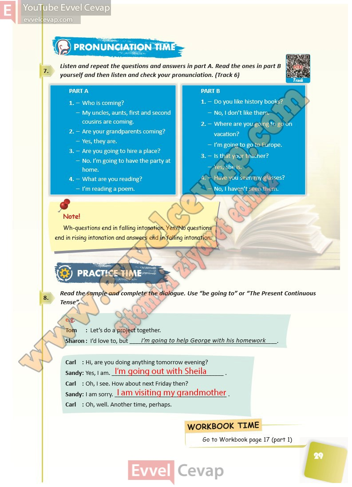

## 10. Sınıf İngilizce Ders Kitabı Cevapları Pasifik Yayınları Sayfa 29

**Soru: Listen and repeat the questions and answers in part A. Read the ones in part B yourself and then listen and check your pronunciation. ( Track 6)**

**Soru: Read the sample and complete the dialogue. Use “be going t o” or “The Present Continuous Tense”.**

**10. Sınıf Pasifik Yayınları İngilizce Ders Kitabı Sayfa 29**