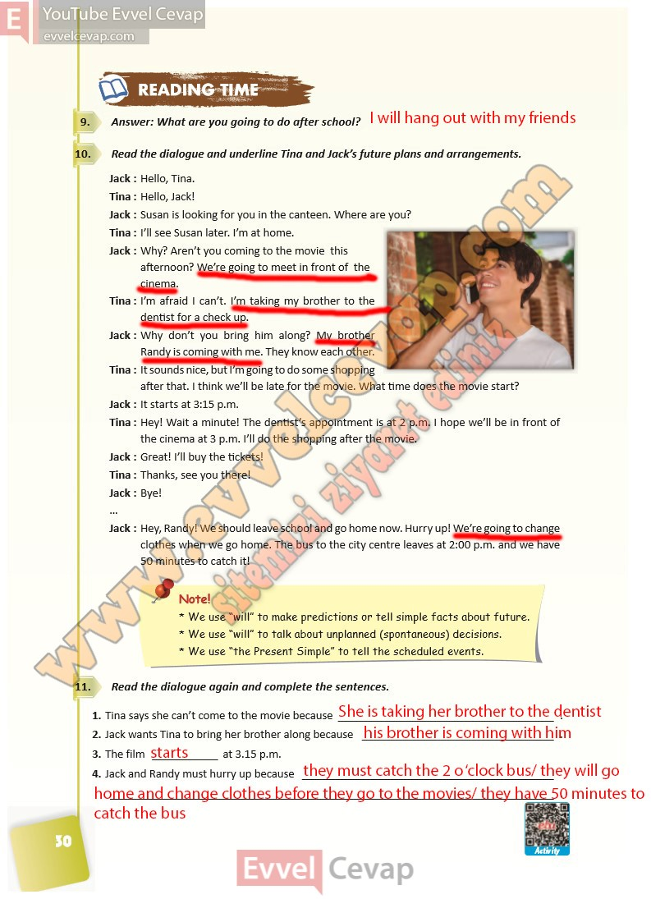

## 10. Sınıf İngilizce Ders Kitabı Cevapları Pasifik Yayınları Sayfa 30

**Soru: Answer: What are you going to do after school?**

**Soru: Read the dialogue and underline Tina and Jack’s future plans and arrangements.**

Jack : Hello, Tina.  
 Tina : Hello, Jack!  
 Jack : Susan is looking for you in the canteen. Where are you?  
 Tina : I’ll see Susan later. I’m at home.  
 Jack : Why? Aren’t you coming to the movie this  
 afternoon? We’re going to meet in front of the  
 cinema.  
 Tina : I’m afraid I can’t. I’m taking my brother to the  
 dentist for a check up.  
 Jack : Why don’t you bring him along? My brother  
 Randy is coming with me. They know each other.  
 Tina : It sounds nice, but I’m going to do some shopping  
 after that. I think we’ll be late for the movie. What time does the movie start?  
 Jack : It starts at 3:15 p.m.  
 Tina : Hey! Wait a minute! The dentist’s appointment is at 2 p.m. I hope we’ll be in front of  
 the cinema at 3 p.m. I’ll do the shopping after the movie.  
 Jack : Great! I’ll buy the tickets!  
 Tina : Thanks, see you there!  
 Jack : Bye!  
 Jack : Hey, Randy! We should leave school and go home now. Hurry up! We’re going to change  
 clothes when we go home. The bus to the city centre leaves at 2:00 p.m. and we have  
 50 minutes to catch it!

**Soru: Read the dialogue again and complete the sentences.**

**10. Sınıf Pasifik Yayınları İngilizce Ders Kitabı Sayfa 30**