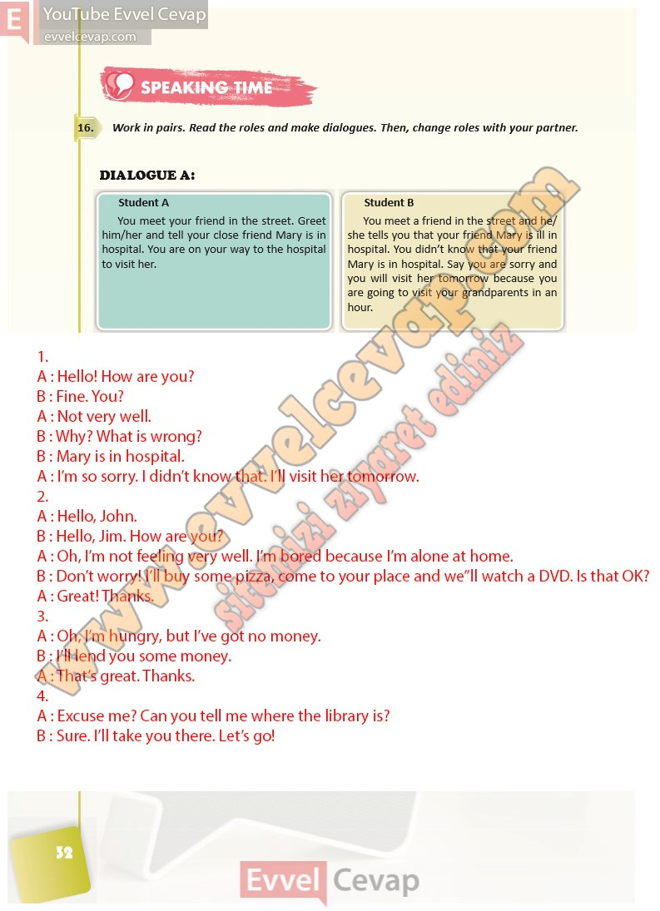

## 10. Sınıf İngilizce Ders Kitabı Cevapları Pasifik Yayınları Sayfa 32

**Soru: Work in pairs. Read the roles and make dialogues. Then, change roles with your partner.**

**10. Sınıf Pasifik Yayınları İngilizce Ders Kitabı Sayfa 32**