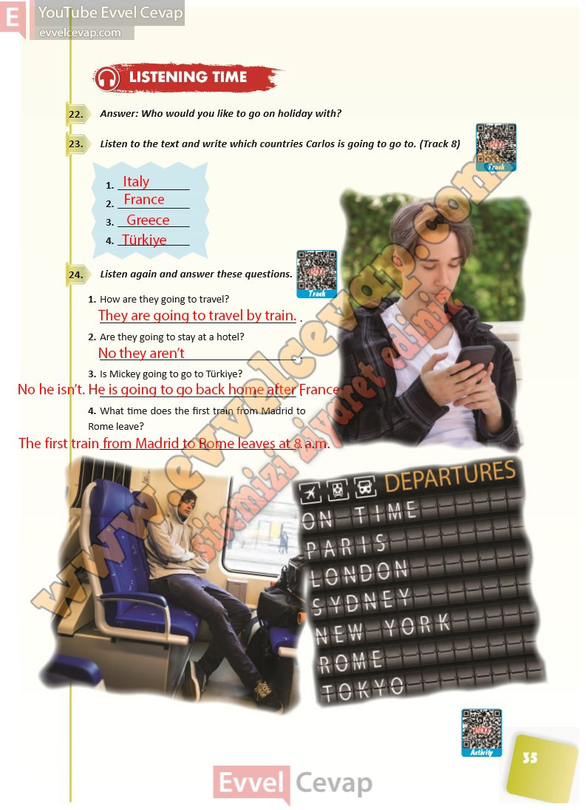

## 10. Sınıf İngilizce Ders Kitabı Cevapları Pasifik Yayınları Sayfa 35

**Soru: Answer: Who would you like to go on holiday with?**

**Soru: Listen to the text and write which countries Carlos is going to go to. (Track 8)**

**Soru: Listen again and answer these questions.**

**Soru: How are they going to travel?**

**Soru: Are they going to stay at a hotel?**

**Soru: Is Mickey going to go to Türkiye?**

**Soru: What time does the first train from Madrid to Rome leave?**

**10. Sınıf Pasifik Yayınları İngilizce Ders Kitabı Sayfa 35**